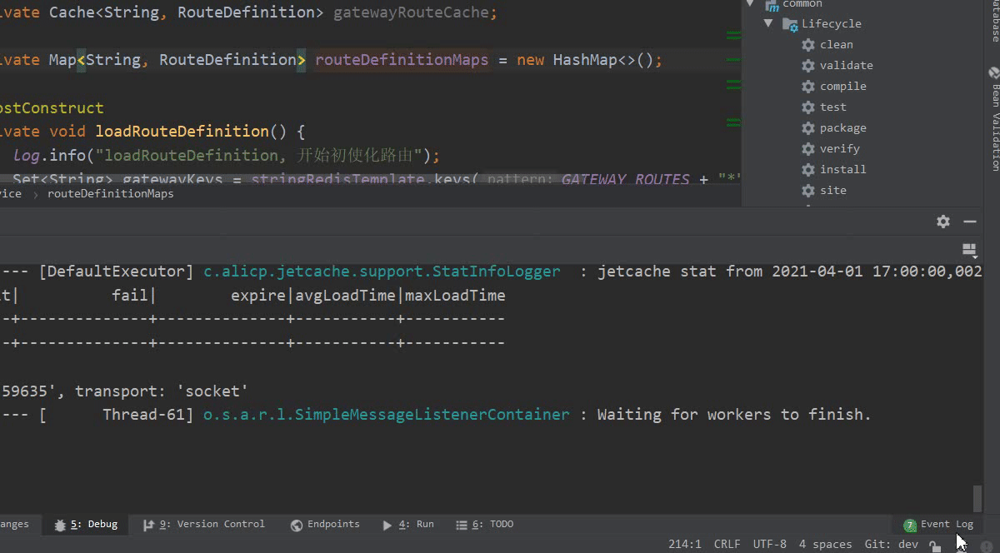
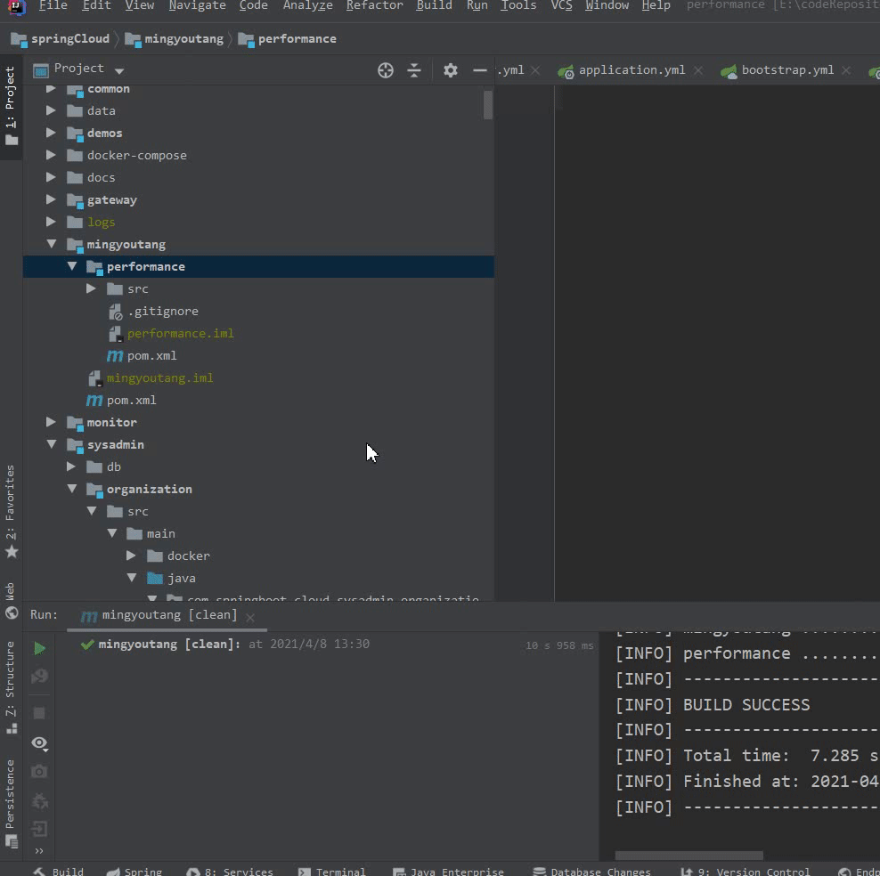
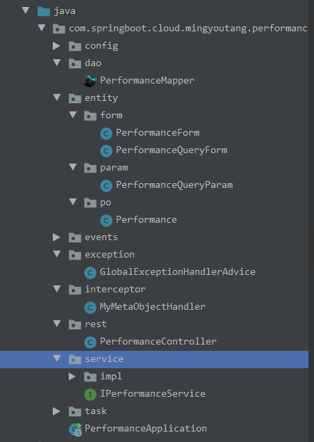

### 一、代码方面

##### 1.如果开发新功能，请从dev上，新建一个开发分支例如future1。【注意，不要再master/dev上开发！！！】

**git项目结构：**

| 分支名称 | 备注         |
| -------- | ------------ |
| master   | 线上稳定版本 |
| dev      | 开发测试版本 |
| future1  | 本地开发版本 |

##### 2.新建模块。
###### 2.1 复制原有模块，重命名，例如【test】
###### 2.2 重命名xxx.iml 文件，例如【test.iml】
###### 2.3 选择xxx.iml, 右键import module

### 2.开发规范参考【performance】项目

