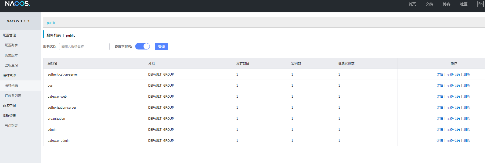
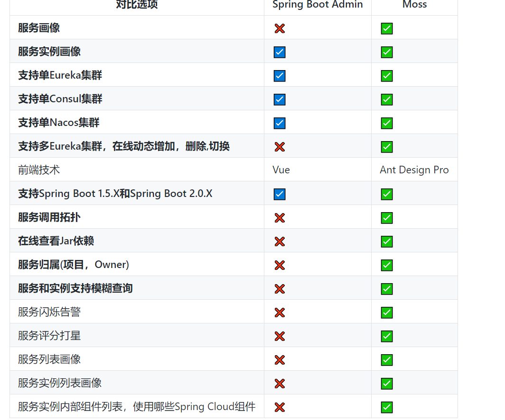
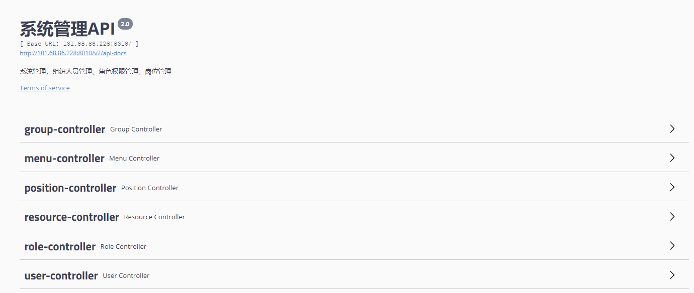
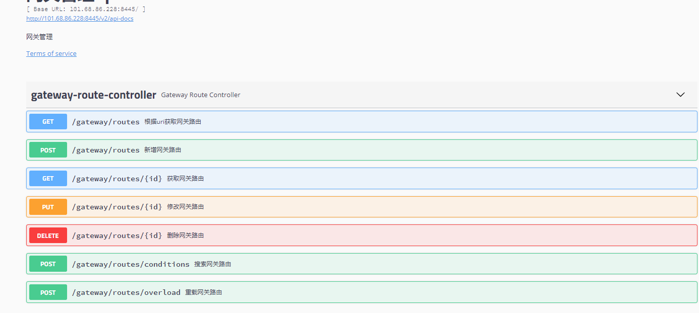
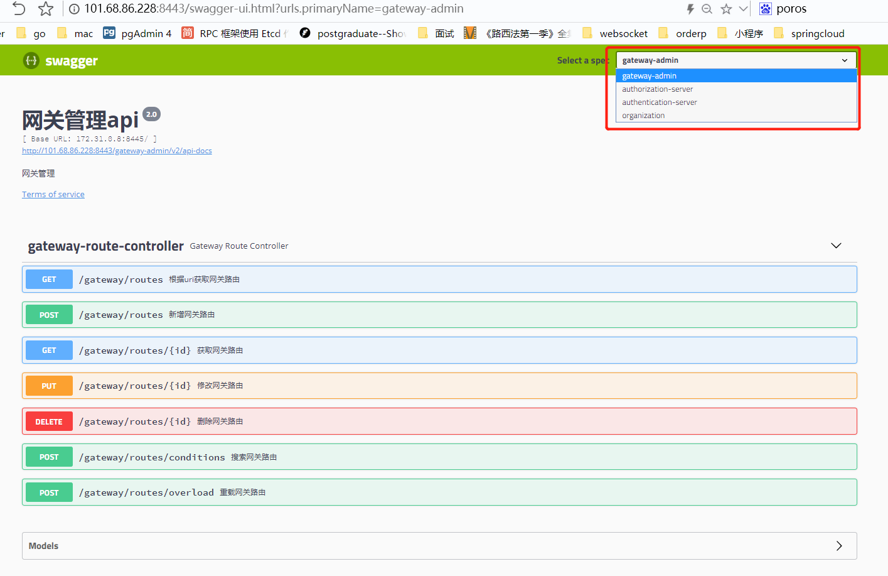

## SpringCloud清单
**git地址：**
- https://gitea.youlishu.com/Youlishu/springcloud

### 1.Nacos
- http://101.68.86.229:8848/nacos/
- http://101.68.86.228:8848/nacos/ [在用]
- 用户名：nacos
- 密码：Sjksh@123
- 安装：[docker拉nacos](https://blog.csdn.net/LI_RONGHUA/article/details/106469926)

### 2.rabbitMQ
- http://101.68.86.228:15672/
- 用户名：guest
- 密码：guest

### 3.moos
【更多文档】http://xujin.org
- http://101.68.86.228:8086
- 用户名：admin
- 密码： 123456

### 4.SpringCloud Bus【center】
- http://101.68.86.228:8071
- 消息刷新：/actuator/bus-refresh

### 5.organzition
- swagger-ui接口页面
- http://101.68.86.228:8010/swagger-ui.html

### 6.authorization-server 【认证中心】
- http://101.68.86.228:8000/
- 用户名：admin
- 密码：password

- [认证中心使用说明](http://r740.youlishu.com:4999/web/#/33?page_id=432)

### 7.authentication-server【鉴权中心】
- http://101.68.86.228:8001

- [鉴权中心使用说明](http://r740.youlishu.com:4999/web/#/33?page_id=433)

### 8.zipKin【链路监控】
- http://101.68.86.228:9411/zipkin/

### 9.Spring Boot admin
- http://101.68.86.228:8022
- 用户：admin
- 密码：123456

### 10.gateway-admin
- http://101.68.86.228:8445/swagger-ui.html

- [网关管理应用说明](http://r740.youlishu.com:4999/web/#/33?page_id=434)

### 11.gateway-ui
- http://101.68.86.228:9443/swagger-ui.html#/gateway-route-controller

- [gateway网关使用说明](http://r740.youlishu.com:4999/web/#/33?page_id=435)